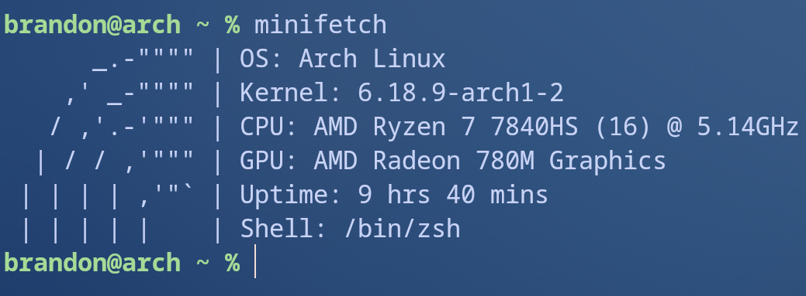
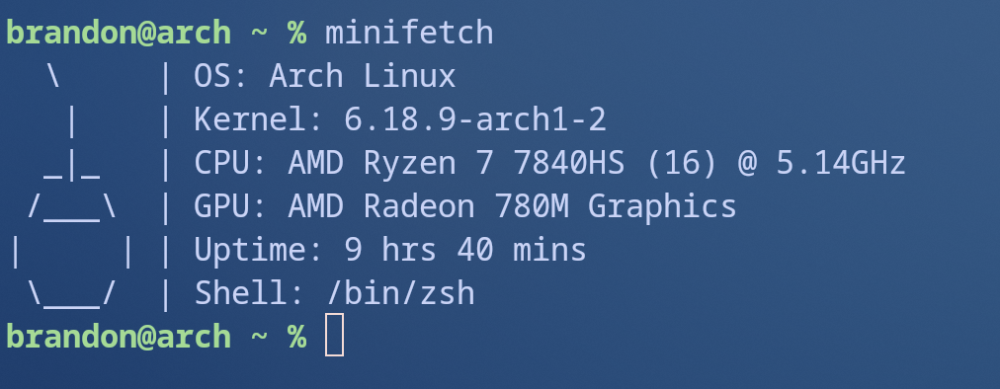
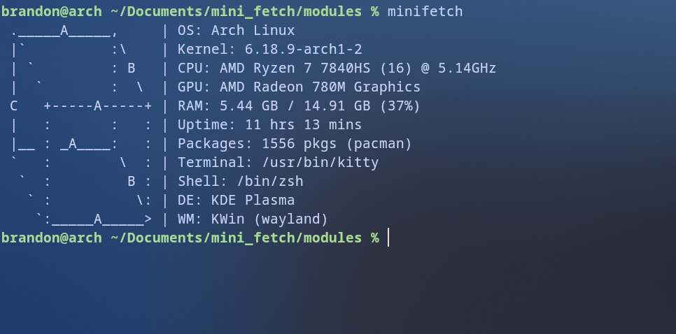

Minifetch is a system fetch tool designed to be minimal while being written in Python. Minifetch picks random ASCII art filtered by module height from a ~6mb local database when ran to remain visually appealing, perfect for ricers.

  

Minifetch uses an ASCII database from the following github repository:
https://github.com/asweigart/asciiartjsondb

Disclaimer:
Minifetch was designed to be a fetch tool for those who value the aesthetic. Minifetch is written in Python and is not designed to be fast, it's a possibility that it will  be rewritten in C++ in the near future.
